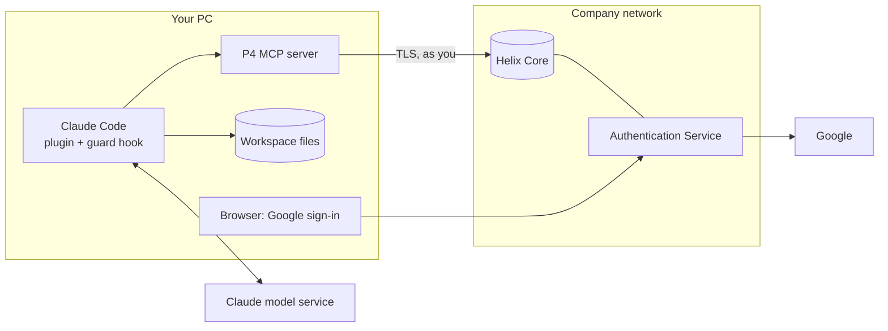
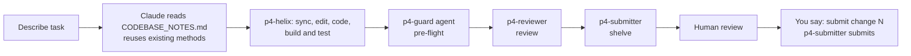

# 11 - Existing workspace: complete guide

One page covering the whole setup for a developer who **already has a Perforce user and workspace** (Google SSO) and wants Claude Code to help write code and then work with Perforce. Details live in [09 diagrams](09-system-boundary-and-integration.md) and [10 skills and agents](10-skills-and-agents-guide.md).

## 1. What you get

| Part | What it gives you |
|---|---|
| Plugin `helix-connector` | 6 skills, 7 agents, 3 commands (`/helix-status`, `/helix-init`, `/helix-learn`) |
| P4 MCP server | Claude's tools for Perforce (query, edit, shelve, submit) |
| Workspace files | `.p4config`, `.p4ignore`, `.mcp.json`, `CLAUDE.md`, `.claude/settings.json`, `.claude/hooks/p4-guard.ps1`, later `CODEBASE_NOTES.md` |
| Guard hook | Claude can read server rules and permissions but cannot edit or delete them |

Claude acts **as you**, with your permissions and your login. It never signs in for you and never sees your password.

## 2. Big picture



Full boundary and sequence diagrams: [09](09-system-boundary-and-integration.md).

## 3. Before you start

You need:

| Item | Where from |
|---|---|
| Perforce user whose **Email** equals your Google account, and an existing **workspace** | Your Helix admin / you already have it |
| A **normal** account, not `admin` or `super` | Onboarding refuses admin accounts unless `-AllowAdminAccount` |
| Server address, e.g. `ssl:helix.company.com:1666` | Your admin |
| Server certificate already trusted (`p4 trust`) | You, after confirming the fingerprint with your admin |
| Windows 10/11, PowerShell, the `p4` command line client, Claude Code | Install yourself |
| This repo cloned (branch `feat/existing-workspace-mode`) | `git clone` |

The P4 MCP server is found automatically; if it is missing, `onboard.ps1` offers to download it (or use `-InstallMcp`, or set `P4MCP_BIN` to your company's approved copy).

## 4. Setup, step by step

### Step 1: connect (once)
```powershell
.\scripts\onboard.ps1 -ExistingWorkspace -User <your.user> -Workspace <existing workspace> -P4Port ssl:helix.company.com:1666
```

| Option | Meaning |
|---|---|
| `-ExistingWorkspace` | Use your workspace; do not create or sync anything |
| `-User` | Your Perforce user |
| `-Workspace` | Exact name of your existing workspace |
| `-P4Port` | Server address (defaults to `p4port` in `connector.config.json`) |
| `-Root` | Workspace folder. Optional: taken from the workspace's Root |
| `-InstallMcp` | Download the MCP server without asking |
| `-SkipLogin` | Do not run `p4 login` (for automation) |
| `-AllowAdminAccount` | Proceed with an admin/super account (not recommended) |
| `-P4Path` | Path to `p4.exe` if not on PATH |

What it does, in order: finds `p4` and the MCP server, checks the server is reachable and trusted, checks you are signed in (runs `p4 login` only if the ticket expired), **refuses admin/super accounts**, confirms the workspace exists, then writes any missing files and installs the guard hook. It never overwrites an existing file.

### Step 2: restart Claude Code
Open the workspace folder in Claude Code (a fresh session) and approve the `perforce-p4-mcp` server when asked. Install the plugin if you have not:
```
/plugin marketplace add <path-or-git-url-of-this-repo>
/plugin install helix-connector@mds-helix
```

### Step 3: check the connection
```
/helix-status
```
You should see your user, workspace and any pending changes. If not, see section 7.

### Step 4: learn the server rules (once)
```
/helix-init
```
`p4-discoverer` reads your access level, groups, layout and MCP policy (read only). Review the proposed changes to `CLAUDE.md`, `.claude/settings.json`, `.p4config` and `.p4ignore`, then approve. Restart Claude Code if `.claude/settings.json` changed.

### Step 5: learn the code (once, refresh later)
```
/helix-learn
```
Pick a scope. `p4-codebase-analyst` reports the stack, domain terms, conventions, best practices and reusable methods. Review the draft and approve; it saves `CODEBASE_NOTES.md`.

## 5. Daily workflow



Phrases that work:

| You want | Say |
|---|---|
| Understand something | "Use p4-reader to show the history of `<file>`" |
| Implement | "Add `<feature>`. Reuse what exists." |
| Pre-flight | "Run p4-guard on my changes" |
| Review | "Review shelved change 12345" |
| Hand over | "Shelve my work" |
| Release | "Submit change 12345" (only then does Claude submit) |
| Standup | "Summarise the last week on `<line>` for standup" |

Rules Claude follows: Perforce only (no git); `edit` before changing a file; numbered changelists; shelve by default; submit only when you ask in that turn; never ask for or show a password or ticket; if the login expired it stops and tells you to run `p4 login`.

## 6. Safety model

| Layer | Protects against | Strength |
|---|---|---|
| Helix protections for **your** user | Anything your account is not allowed to do | **Guarantee** (server enforced) |
| Onboarding refuses admin/super | Claude running with rule-changing power | Strong |
| MCP policy on the server | Write tools when your group is read-only | Strong |
| `p4-guard` hook and deny rules | Claude editing or deleting protections, groups, users, properties | Safety net (reads command text) |
| `p4-guard` agent | Secrets, `.p4config` or `main` in a change | Process check |
| Shelve by default, submit on request | Accidental submits | Process rule |

Server rules and permissions are read-only for Claude. Details: [docs/04](04-mcp-server-tools.md#server-rules-are-read-only-for-claude).

## 7. When something fails

| Symptom | Fix |
|---|---|
| "Login invalid" / expired | You run `p4 login` (Google opens). Claude never logs in for you |
| Cannot reach server | VPN / address; confirm `-P4Port` |
| Certificate not trusted / "IDENTIFICATION HAS CHANGED" | Confirm the fingerprint with your admin, then `p4 -p <server> trust`. Do not trust blindly |
| Workspace not found | Check the name: `p4 clients -u <you>` |
| "Refused: admin/super account" | Use a normal Perforce account for Claude |
| Tools missing in Claude Code | Restart Claude Code in the workspace; approve `perforce-p4-mcp` |
| "Blocked by helix-connector" | The hook stopped a rule/permission change. Ask your Helix admin |
| A tool says it is blocked | A server MCP policy applies; do not work around it |
| Google sign-in fails | Google email must equal your Perforce Email exactly |

More: [07 Troubleshooting](07-troubleshooting.md), and the `p4-troubleshoot` skill.

## 8. Files reference

| File | Created by | Purpose | In the depot? |
|---|---|---|---|
| `.p4config` | onboard, `/helix-init` | Server, user, workspace | No (ignored) |
| `.p4ignore` | onboard, `/helix-init` | Files Perforce should skip | No |
| `.mcp.json` | onboard | Starts the MCP server for this folder | No |
| `CLAUDE.md` | onboard, `/helix-init`, `/helix-learn` | Rules Claude follows here | Your choice |
| `.claude/settings.json` | onboard, `/helix-init` | Deny rules and the guard hook | Your choice |
| `.claude/hooks/p4-guard.ps1` | onboard | Blocks rule/permission edits | Your choice |
| `CODEBASE_NOTES.md` | `/helix-learn` | Domain, conventions, reusable methods | Ignored by default |

## 9. Limits and what is verified

- Windows only for now.
- `p4-feature-line`, `p4-submitter` and the `p4-guard` agent assume a `main` / `dev` / `features` layout. If your project differs, `/helix-init` records the real writable folders in `CLAUDE.md`; tell Claude to follow those, or adjust the agent files.
- No Swarm / code-review integration and no streams support.
- Tested with a fake `p4` stand-in: the existing-workspace flow, admin refusal, and the guard hook (23 command cases). **Not yet tested:** against a real Helix server, Claude Code loading the hook and plugin, and the agents' restricted `Bash(p4 ...)` tool lists (they fall back to MCP tools and Read/Grep/Glob if not accepted).

Previous: [10 - Skills and agents guide](10-skills-and-agents-guide.md)
