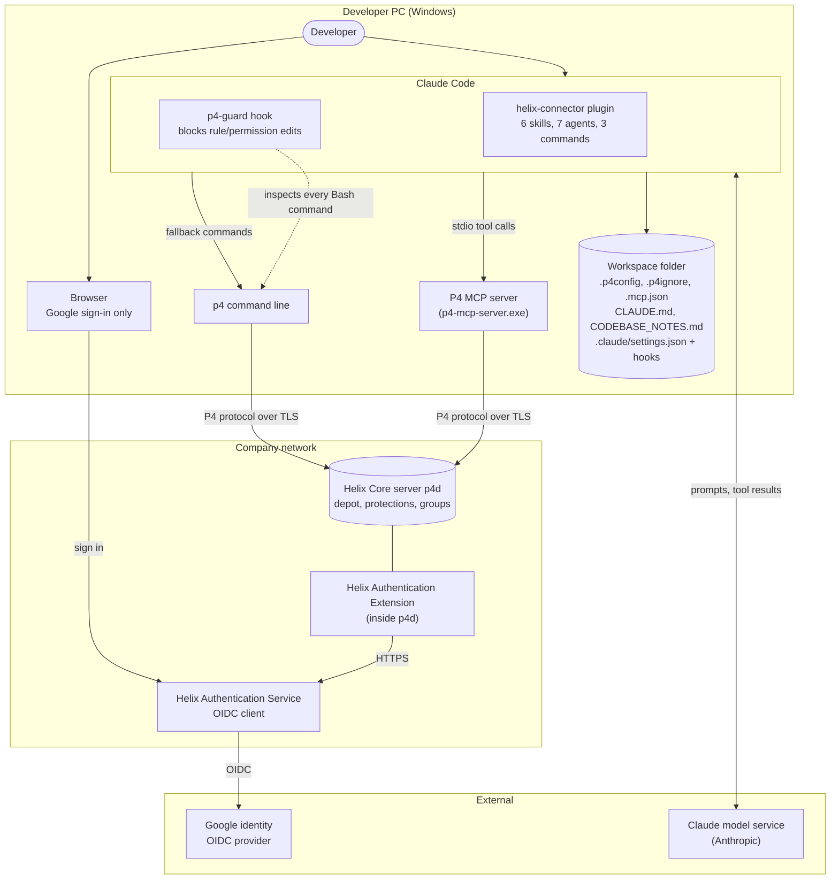
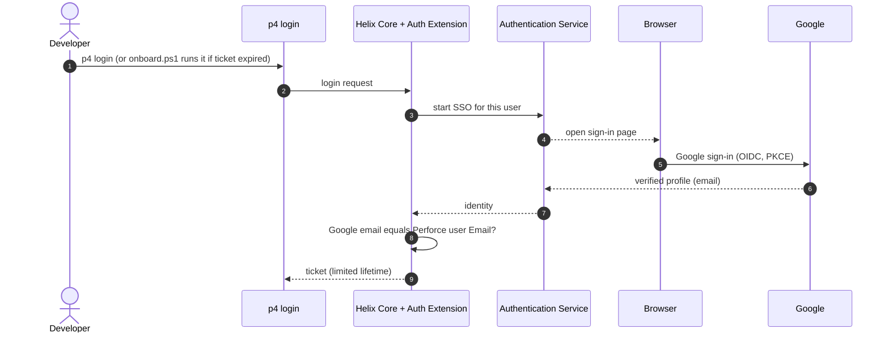
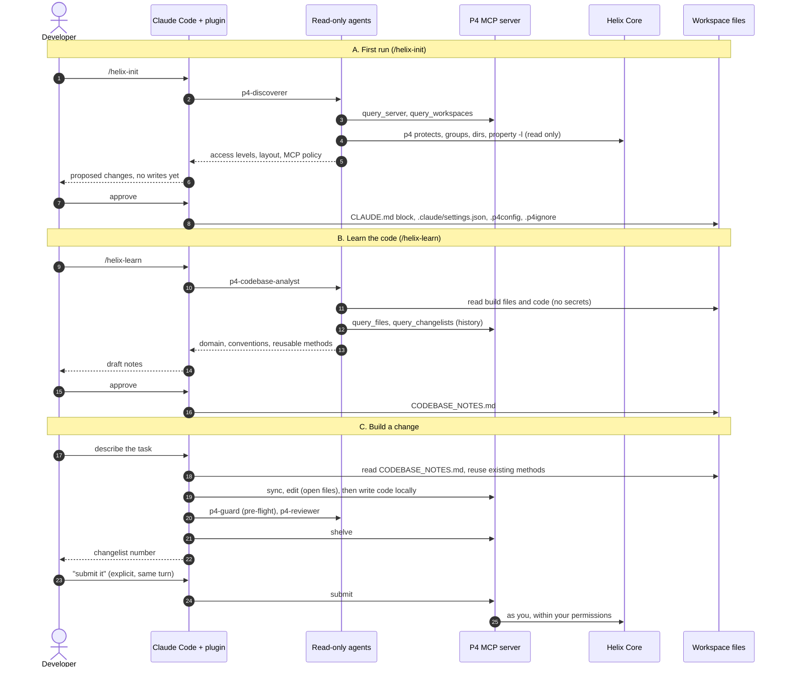
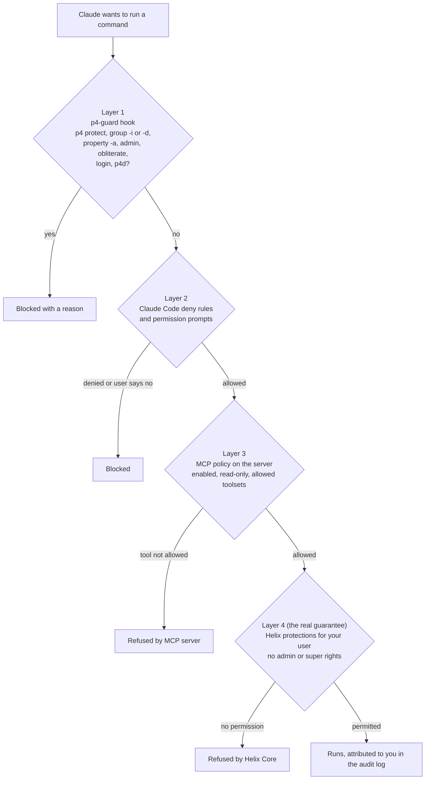
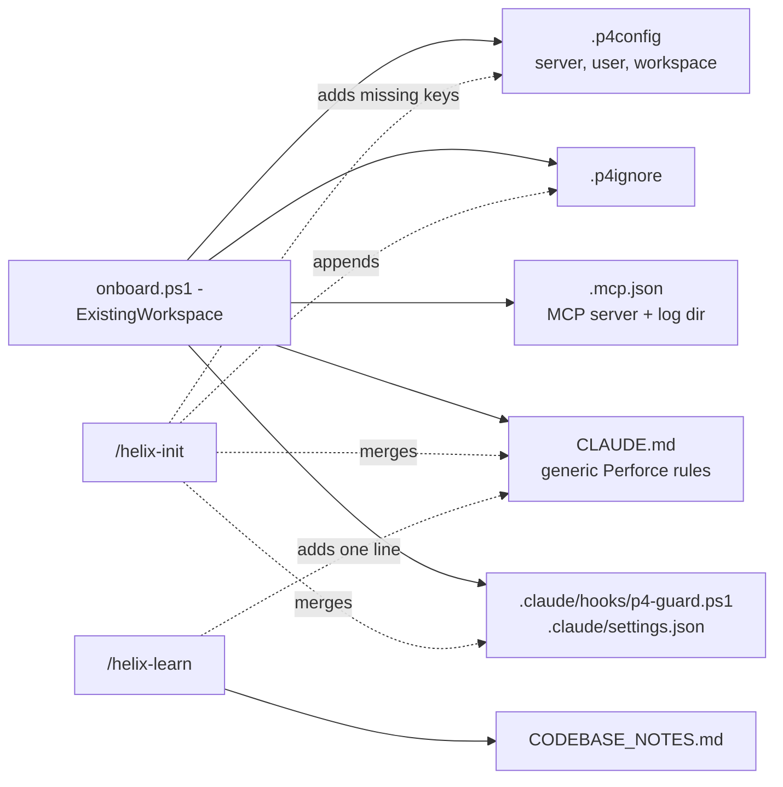

# 01 - System boundary and integration diagrams

Applies to the **existing workspace** setup (`onboard.ps1 -ExistingWorkspace`): you already have a Perforce user and workspace, and sign in with Google SSO. Diagrams are Mermaid, so GitHub renders them.

## 1. System boundary

What is inside the developer's PC, what is inside the company network, and what is external.

Boundaries to know about:

| Boundary | What crosses it | Control |
|---|---|---|
| PC to Helix Core | P4 protocol over TLS; your ticket | Server certificate pinned by fingerprint (`p4 trust`); server enforces protections as **you** |
| PC to Google / Authentication Service | Browser sign-in only | Google email must equal the Perforce user's Email; Claude never sees the password |
| Claude Code to the Claude model service | Prompts, file contents Claude reads, tool results | Do not point Claude at secrets; deny rules and `.p4ignore` keep them out; ask your security team if depot code is restricted |
| Claude to Helix Core | Read, edit, shelve, submit as the signed-in user | Server permissions, MCP policy, `p4-guard` hook (see section 3) |

## 2. Integration: how the pieces work together

### 2.1 Sign-in (done by you, not Claude)

### 2.2 First run, learn, work

## 3. Layers that keep server rules read-only

Claude may **read** protections, groups, users and MCP policy. It cannot edit or delete them.

Layers 1 and 2 inspect command text, so they are safety nets. Layer 4 is the guarantee, which is why `onboard.ps1` refuses an `admin` or `super` account unless you pass `-AllowAdminAccount`.

## 4. Files created in the workspace

Solid arrows create a file; dotted arrows merge into one that exists. Existing files are never overwritten.

Next: [02 - Skills and agents guide](02-skills-and-agents-guide.md)
