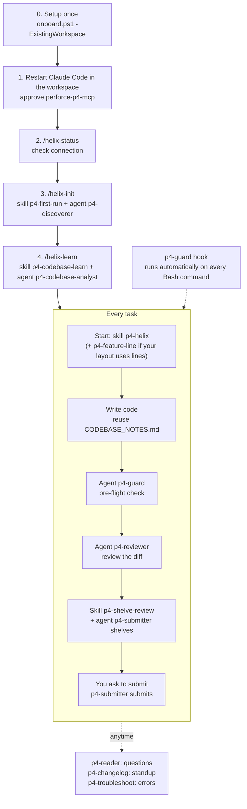

# 02 - Skills, agents, commands and hook: what, why, how, and in what order

Everything here ships in the `helix-connector` plugin. **Skills** are instructions Claude follows when the situation matches. **Agents** are focused helpers that run on their own with limited tools. **Commands** are shortcuts you type. The **hook** runs automatically.

## 1. Order of use (existing workspace)

| Step | Do | Why it comes here |
|---|---|---|
| 0 | `onboard.ps1 -ExistingWorkspace ...` | Connects Claude to your existing user and workspace without changing them |
| 1 | Restart Claude Code in the workspace folder, approve `perforce-p4-mcp` | MCP tools only load at session start |
| 2 | `/helix-status` | Proves the connection and login work before anything else |
| 3 | `/helix-init` | Learns what the live server lets **you** do, so later rules match reality |
| 4 | `/helix-learn` | Learns the code before writing code, so new code reuses existing methods |
| 5 | Per task: implement, guard, review, shelve, submit | Safe path from edit to server |

Run steps 3 and 4 once per workspace, then again when the server rules or the code have changed a lot.

## 2. Commands (you type these)

| Command | What it does | Use it when |
|---|---|---|
| `/helix-status` | Shows your user, server, workspace, ticket state and pending changes | First thing in a session, or when something looks wrong |
| `/helix-init` | Runs `p4-first-run`: reads the live server's rules and proposes updates to `CLAUDE.md`, `.claude/settings.json`, `.p4config`, `.p4ignore` | Once after onboarding, and after your permissions change |
| `/helix-learn` | Runs `p4-codebase-learn`: studies the code and saves `CODEBASE_NOTES.md` | Once after `/helix-init`, before building features in an unfamiliar area |

## 3. Skills (Claude applies these on its own, or you ask)

### p4-first-run
- **What:** Discovers your access level, groups, workspace view, layout and MCP policy (read-only), then proposes file changes and writes them only after you approve.
- **Why:** Rules written for another project do not fit yours. This makes `CLAUDE.md` and the allow/deny list match what the server actually permits.
- **How:** Type `/helix-init`, read the proposed changes, approve. It stops if your account has `admin` or `super` rights. It merges into existing files and never overwrites your own content.
- **Writes:** `CLAUDE.md` (managed block), `.claude/settings.json`, `.p4config` (missing keys), `.p4ignore` (missing lines).

### p4-codebase-learn
- **What:** Has the analyst agent read the code and produce notes on stack, structure, domain terms, conventions, best practices and reusable methods.
- **Why:** Stops duplicate helpers and style drift. Later work reads the notes first.
- **How:** Type `/helix-learn`, name the scope (a module or the whole workspace), review the draft, approve.
- **Writes:** `CODEBASE_NOTES.md` in the workspace root, a line in `CLAUDE.md`, and an entry in `.p4ignore` unless you want it in the depot.

### p4-helix
- **What:** The everyday Perforce method: sync, `edit` before changing a file, numbered changelists, `reconcile`, shelve, then wait for you to ask for a submit. Includes a table of which MCP tool does what.
- **Why:** Perforce files are read-only until opened and this is not Git. This keeps Claude from fighting the tool.
- **How:** Automatic whenever Claude works on files in the workspace. Ask: "use the Perforce workflow for this change".

### p4-feature-line
- **What:** Explains the `main` / `dev` / `features/<name>` layout and how to start a feature line.
- **Why:** Developers write feature lines and cannot write `main`.
- **How:** Use it only if your project uses that layout. If yours differs, `/helix-init` records the real writable folders in `CLAUDE.md`, and you should tell Claude to follow those instead.

### p4-shelve-review
- **What:** Shelve, unshelve, update a shelf, share work in progress.
- **Why:** Shelving is the default hand-over, so a human reviews before anything is submitted.
- **How:** Say "shelve this" or "update my shelf".

### p4-troubleshoot
- **What:** Fixes for login invalid, connection refused, unknown host, trust/fingerprint warnings and "no permission".
- **Why:** The common failures have known causes; this avoids guessing.
- **How:** Automatic when a call fails. Never works around a permission error, never asks for your password.

## 4. Agents (focused helpers)

| Agent | Can it change anything? | What it does | Why | How to use |
|---|---|---|---|---|
| `p4-discoverer` | No | Reads your access level per folder, groups, ticket timeout, layout, streams, `mcp.*` policy | Feeds `/helix-init` with facts | Runs inside `/helix-init` |
| `p4-codebase-analyst` | No | Reads code, returns a sectioned report with `path:line` evidence | Feeds `/helix-learn`; also answers "how does this code base do X" | Runs inside `/helix-learn`, or ask directly |
| `p4-reader` | No | Answers questions: file contents, history, blame, diffs, who changed what | A hard guarantee that nothing changes while you investigate | "Use p4-reader to show who last changed X" |
| `p4-changelog` | No | Summarises recent submitted changes by theme with authors and changelist numbers | Standups and release notes | "Summarise last week on `<line>` for standup" |
| `p4-reviewer` | No | Reviews a shelved, pending or submitted changelist for bugs, security and style | A first review before a human reviews | "Review shelved change 12345" |
| `p4-guard` | No | Pre-flight before shelve or submit: no `.p4config`, keys or secrets in opened files, nothing targeting `main` | Stops credentials and wrong-line writes before they leave your PC | "Run p4-guard on change 12345" |
| `p4-submitter` | **Yes** | Opens files, manages changelists, shelves; submits only on your explicit request in that turn | The only agent allowed to write to the server, so it is tightly rules-bound | "Shelve my work" / "Submit change 12345" |

> Two things are named `p4-guard`. The **agent** is the pre-flight check on your opened files. The **hook** is the automatic command filter in section 5.

## 5. The p4-guard hook (automatic)

- **What:** A `PreToolUse` hook that checks every Bash command Claude is about to run. It blocks commands that would edit or delete server rules and permissions, such as `p4 protect`, `p4 group -i/-d`, `p4 user -i/-d`, `p4 property -a/-d`, `p4 admin`, `p4 obliterate`, `p4 login`, `p4d`, and the admin scripts.
- **Allows:** Reading rules, for example `p4 protects`, `p4 group -o`, `p4 property -l`.
- **Why:** Claude can read the rules to follow them but must never change them.
- **How:** Nothing to do. It ships in the plugin, and `onboard.ps1` also copies it to `.claude/hooks/`. If it blocks something, the message says why; ask your Helix admin for rule changes.
- **Limit:** It reads command text, so a determined workaround is stopped only by the server (your account has no admin rights).

## 6. Typical session

1. Open the workspace folder in Claude Code. `/helix-status`.
2. Ask: "Add email validation to the customer import." Claude reads `CODEBASE_NOTES.md`, finds the existing validator, and reuses it.
3. Claude uses `p4-helix` to sync, `edit`, change code, and run your build and tests.
4. "Run the guard and a review." You get PASS or BLOCKED, then findings.
5. "Shelve it." `p4-submitter` shelves and gives you the changelist number.
6. A human reviews. When you are ready: "Submit change 12345."

Previous: [01 - System boundary and integration](01-system-boundary-and-integration.md) | Next: [03 - Complete guide](03-complete-guide.md)
