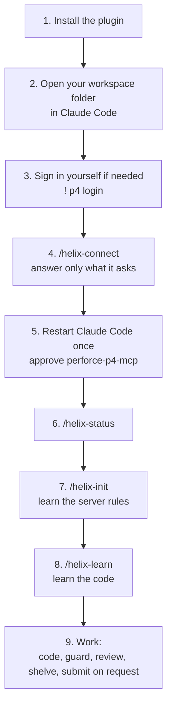
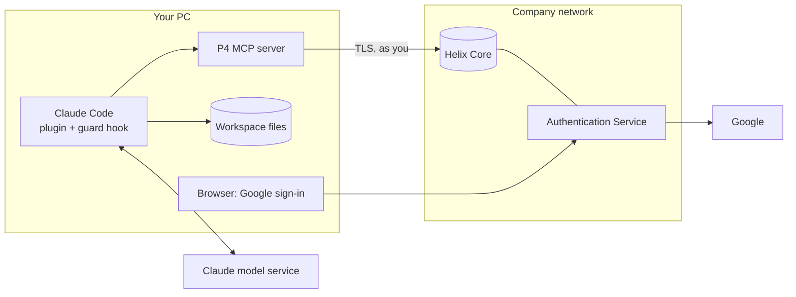
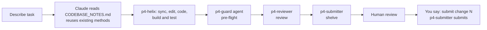

# 03 - Existing workspace: complete guide

One page covering the whole setup for a developer who **already has a Perforce user and workspace** (Google SSO) and wants Claude Code to help write code and then work with Perforce. Details live in [01 diagrams](01-system-boundary-and-integration.md) and [02 skills and agents](02-skills-and-agents-guide.md).

## 1. What you get

| Part | What it gives you |
|---|---|
| Plugin `helix-connector` | 7 skills, 7 agents, 4 commands (`/helix-connect`, `/helix-status`, `/helix-init`, `/helix-learn`) |
| P4 MCP server | Claude's tools for Perforce (query, edit, shelve, submit) |
| Workspace files | `.p4config`, `.p4ignore`, `CLAUDE.md`, `.claude/settings.json`, later `CODEBASE_NOTES.md` |
| Guard hook | Claude can read server rules and permissions but cannot edit or delete them |

Claude acts **as you**, with your permissions and your login. It never signs in for you and never sees your password.

## 2. Order of connecting



| # | Do | Details |
|---|---|---|
| 1 | Install the plugin | `/plugin marketplace add <path-or-git-url>` then `/plugin install helix-connector@mds-helix`. No clone of the kit is needed beyond the marketplace source |
| 2 | Open your workspace folder | Open the folder that is your workspace Root. `/helix-connect` works on the current folder |
| 3 | `! p4 login` | Only if not signed in. Google opens in the browser. Claude never does this for you |
| 4 | `/helix-connect` | Detects your user, server and workspace; checks trust, login, and that you are not admin; writes the missing files. It may ask for the server, user or workspace, and whether to download the P4 MCP server |
| 5 | Restart Claude Code, approve `perforce-p4-mcp` | The Perforce tools load only at session start. Needed the first time (and after `P4MCP_BIN` is set) |
| 6 | `/helix-status` | Shows your user, workspace and pending changes |
| 7 | `/helix-init` | Reads the live server's rules for **your** user and proposes updates to `CLAUDE.md`, `.claude/settings.json`, `.p4config`, `.p4ignore`. Nothing is written until you approve |
| 8 | `/helix-learn` | Pick a scope; saves `CODEBASE_NOTES.md` after you approve |
| 9 | Work | See section 5 |

Steps 1 to 8 happen once per workspace. Re-run 7 and 8 when the server rules or the code change a lot.

### Alternative: connect with a script
If you prefer a script to `/helix-connect`, clone the kit and run, in place of step 4:
```powershell
.\scripts\onboard.ps1 -ExistingWorkspace -User <your.user> -Workspace <existing workspace> -P4Port ssl:helix.company.com:1666
```
It does the same checks, but also writes `.mcp.json` and copies the guard hook into the workspace. Options: `-Root`, `-InstallMcp`, `-SkipLogin`, `-AllowAdminAccount`, `-P4Path`. Everything else (steps 5 to 9) is the same.

## 3. Before you start

| Item | Where from |
|---|---|
| Perforce user whose **Email** equals your Google account, and an existing **workspace** | Your Helix admin / you already have it |
| A **normal** account, not `admin` or `super` | `/helix-connect` and `onboard.ps1` refuse admin accounts unless you explicitly accept the risk |
| Server certificate already trusted (`p4 trust`) | You, after confirming the fingerprint with your admin. `/helix-connect` never trusts it for you |
| Windows 10/11, PowerShell, the `p4` command line client, Claude Code | Install yourself |
| The P4 MCP server | `/helix-connect` offers to download it (only if you say yes), or set `P4MCP_BIN` to your company's approved copy |

An admin can pre-set the server address for everyone in `plugins/helix-connector/connect/connect.config.json` before sharing the plugin, so developers never type it.

## 4. Big picture



Full boundary and sequence diagrams (including the connect sequence): [01](01-system-boundary-and-integration.md).

## 5. Daily workflow



Phrases that work:

| You want | Say |
|---|---|
| Understand something | "Use p4-reader to show the history of `<file>`" |
| Implement | "Add `<feature>`. Reuse what exists." |
| Pre-flight | "Run p4-guard on my changes" |
| Review | "Review shelved change 12345" |
| Hand over | "Shelve my work" |
| Release | "Submit change 12345" (only then does Claude submit) |
| Standup | "Summarise the last week on `<line>` for standup" |

Rules Claude follows: Perforce only (no git); `edit` before changing a file; numbered changelists; shelve by default; submit only when you ask in that turn; never ask for or show a password or ticket; if the login expired it stops and tells you to run `p4 login`.

## 6. Safety model

| Layer | Protects against | Strength |
|---|---|---|
| Helix protections for **your** user | Anything your account is not allowed to do | **Guarantee** (server enforced) |
| Connect refuses admin/super | Claude running with rule-changing power | Strong |
| MCP policy on the server | Write tools when your group is read-only | Strong |
| `p4-guard` hook and deny rules | Claude editing or deleting protections, groups, users, properties | Safety net (reads command text) |
| `p4-guard` agent | Secrets, `.p4config` or `main` in a change | Process check |
| Shelve by default, submit on request | Accidental submits | Process rule |

Server rules and permissions are read-only for Claude. Details: [docs/04](../04-mcp-server-tools.md#server-rules-are-read-only-for-claude).

## 7. When something fails

| Symptom | Fix |
|---|---|
| `/helix-connect` says not signed in | Run `! p4 login`, then `/helix-connect` again |
| `/helix-connect` says certificate not trusted | Confirm the fingerprint with your Helix admin, then `p4 -p <server> trust`, then again |
| `/helix-connect` asks for server, user or workspace | Answer it; it could not detect that item from your Perforce settings |
| "Several workspaces match this folder" | Tell it which one |
| "No workspace has this folder as its Root" | Open Claude Code in the workspace folder, or give the workspace name |
| Admin/super account refused | Use a normal Perforce account for Claude |
| Perforce tools missing in Claude Code | Restart Claude Code in the workspace; approve `perforce-p4-mcp` |
| "Login invalid" / expired later | You run `p4 login`. Claude never logs in for you |
| Cannot reach server | VPN / address |
| "Blocked by helix-connector" | The hook stopped a rule/permission change. Ask your Helix admin |
| A tool says it is blocked | A server MCP policy applies; do not work around it |
| Google sign-in fails | Google email must equal your Perforce Email exactly |

More: [07 Troubleshooting](../07-troubleshooting.md), and the `p4-troubleshoot` skill.

## 8. Files reference

| File | Created by | Purpose | In the depot? |
|---|---|---|---|
| `.p4config` | `/helix-connect`, `/helix-init` | Server, user, workspace | No (ignored) |
| `.p4ignore` | `/helix-connect`, `/helix-init` | Files Perforce should skip | No |
| `CLAUDE.md` | `/helix-connect`, `/helix-init`, `/helix-learn` | Rules Claude follows here | Your choice |
| `.claude/settings.json` | `/helix-connect`, `/helix-init` | Deny rules | Your choice |
| `CODEBASE_NOTES.md` | `/helix-learn` | Domain, conventions, reusable methods | Ignored by default |
| `.mcp.json`, `.claude/hooks/p4-guard.ps1` | Script path only | MCP server start; guard hook | Your choice |

With the plugin path the MCP server config and the guard hook come from the plugin itself.

## 9. Limits and what is verified

- Windows only for now.
- `p4-feature-line`, `p4-submitter` and the `p4-guard` agent assume a `main` / `dev` / `features` layout. If your project differs, `/helix-init` records the real writable folders in `CLAUDE.md`; tell Claude to follow those, or adjust the agent files.
- No Swarm / code-review integration and no streams support.
- Tested with a fake `p4` stand-in: `/helix-connect`'s script (missing info, untrusted, not signed in, admin refusal, full run, re-run, MCP missing), the existing-workspace script path, and the guard hook (23 command cases). **Not yet tested:** against a real Helix server, Claude Code loading the plugin, command and hook, the MCP download, and the agents' restricted `Bash(p4 ...)` tool lists (they fall back to MCP tools and Read/Grep/Glob if not accepted).

Previous: [02 - Skills and agents guide](02-skills-and-agents-guide.md)
